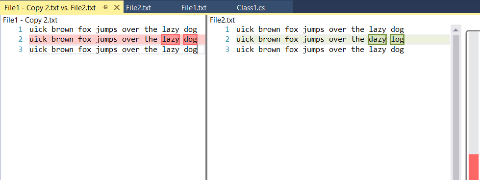

# File Comparer

<!-- Update the VS Gallery link after you upload the VSIX-->
Download this extension from the [VS Gallery](https://visualstudiogallery.msdn.microsoft.com/[GuidFromGallery])
or get the [CI build](http://vsixgallery.com/extension/58d83af4-8f4c-48c1-85fb-25bfc5717873/).

---------------------------------------

Visual Studio Extension to compare two files in solution explorer.

See the [changelog](CHANGELOG.md) for changes and roadmap.

## Features

- Compare two files in solution explorer.

### Compare two files
Select two files in solution explorer and right click to get Compare Files... option to compare the selected files.

When Compare Files... option selected, both the files will be opened in left panel and show the difference.

## Contribute
Check out the [contribution guidelines](CONTRIBUTING.md)
if you want to contribute to this project.

For cloning and building this project yourself, make sure
to install the
[Extensibility Tools 2015](https://visualstudiogallery.msdn.microsoft.com/ab39a092-1343-46e2-b0f1-6a3f91155aa6)
extension for Visual Studio which enables some features
used by this project.

## License
[Apache 2.0](LICENSE)